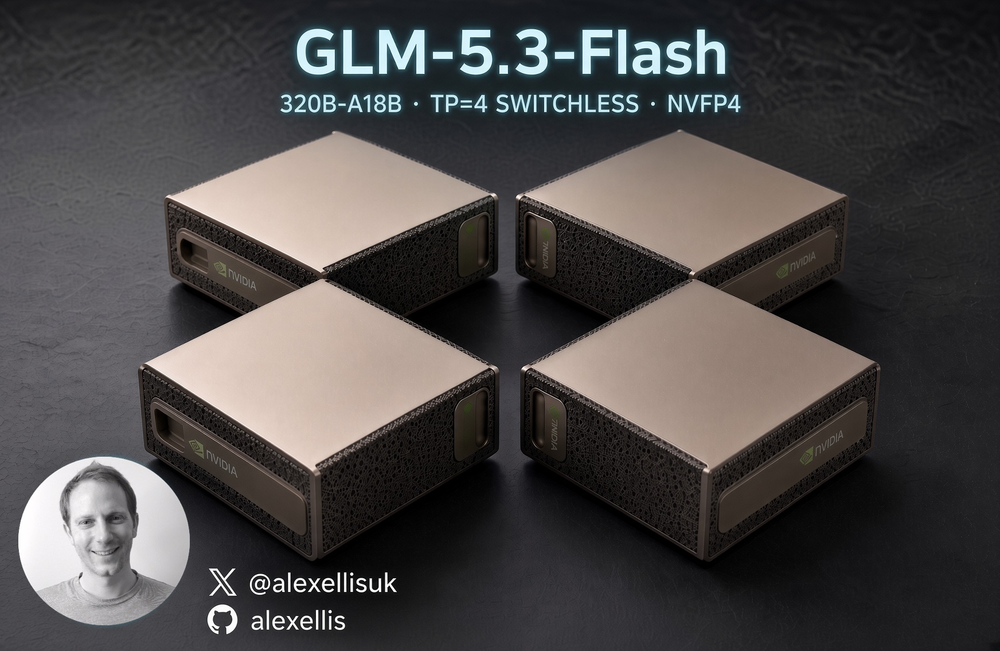

# GLM-5.3-Flash NVFP4 — 4× DGX Spark, switchless-ring TP4 + DFlash2



Serve **GLM-5.3-Flash (NVFP4)** across **four NVIDIA DGX Spark (GB10 / `sm_121`)
nodes** as one tensor-parallel engine — joined by a **switchless RoCE ring** and
accelerated by the **DFlash2 speculative drafter**. One OpenAI-compatible endpoint,
a 262K context window, ~45 tok/s on real agentic traffic — on hardware you own.

This repository is the **recipe and the contract**: every address, interface, and
hostname is a placeholder you swap for your own — nothing here depends on a private
gateway, router, or network.

Built and run in production by **Alex Ellis** / **OpenFaaS Ltd** —
[github.com/alexellis](https://github.com/alexellis) ·
[x.com/alexellisuk](https://x.com/alexellisuk). Licensed **MIT** (see
[`LICENSE`](LICENSE)).

---

## Do you actually need a switch? No.

The received wisdom is that multi-node tensor parallelism needs a 100/400 GbE
switch on the fabric. For a four-node build it doesn't — and today, avoiding one is
a feature rather than a compromise.

This recipe cables the four Sparks into a **closed RoCE ring**: two rails per node,
each wired straight to two neighbours, with the non-adjacent hop relayed through a
neighbour (the routes and `DOCKER-USER` forwarding in
[`scripts/fabric-setup.sh`](scripts/fabric-setup.sh) handle it). No switch on the
data path — and, just as importantly, no switch on the **procurement** path, which
is the part that actually bites right now.

If you did want one, MikroTik now covers every tier — real UK prices (inc VAT)
and stock, checked **31 August 2026**:

| Model | UK price (inc VAT) | Stock | Power · noise |
|---|---|---|---|
| **CRS504-4XQ-IN** — 4× 100G QSFP28, compact | from **£599.44** | **Out of stock** UK-wide (LinITX awaiting restock) | 41 W · 2 fans, near-silent, desk-tolerable |
| **CRS520-4XS-16XQ-RM** — 16× 100G QSFP28, 1U ToR | **£1,679.99** (LinITX) | **3 in stock**, despatch today | 150 W · 4 fans, rack acoustics |
| **CRS804-4DDQ-hRM** — 4× 400G QSFP-DD, half-width | **£1,139.99** (LinITX) | Pre-order: batches **2 Oct** / **18 Dec 2026** | 123 W · 2 fans, the quiet 400G |
| **CRS812-8DS-2DQ-2DDQ-RM** — 2× 400G + 2× 200G, 1U ToR | **£1,040.64** (Senetic) | **5 available** (Senetic) | 134 W · 4 fans, loud with optics — rack it |

**Supply-chain reality (2026):** the table *is* the story — the cheapest box is
sold out UK-wide and the newest 400G part is pre-sold into October; what you can
buy today is the 100G ToR. For a four-node build the switchless ring removes the
switch, *and its lead time*, from the critical path entirely. Reach for a switch
when you scale past four nodes or want to change topology without re-cabling —
supplier links, heat figures, and port-fit notes are in
[`docs/switches.md`](docs/switches.md).

---

## At a glance

Four DGX Sparks in a **switchless RoCE ring** — each node cabled to two
neighbours. Non-adjacent nodes talk by **relaying through a neighbour**: A reaches
D via B or C (and B reaches C via A or D), using the routes + `DOCKER-USER`
forwarding that [`scripts/fabric-setup.sh`](scripts/fabric-setup.sh) applies. One
OpenAI-compatible endpoint (model id `glm-5.3-flash`) comes out of the head node.

```
        A ───────── B      Cabled ring links:  A–B · A–C · B–D · C–D
        │           │
        │           │      Diagonals (NOT cabled) relay via a neighbour:
        │           │        A ↔ D   via B or C
        C ───────── D        B ↔ C   via A or D
```

---

## Real serving numbers (measured, not marketed)

Most recipes quote a synthetic benchmark. These are the actual serving records from
running this deployment as a **daily driver** — real agentic coding traffic through
an OpenAI-compatible gateway, not a load-generator. **TP4 only: figures from the
earlier 2× bring-up are excluded.**

| Metric | Measured (TP4, 4 nodes) |
|---|---|
| Requests served | **476** |
| Tokens through the model | **~17.5M** (17.2M prompt · 297K completion) |
| Decode on real generations (≥150 tok) | **~45 tok/s** typical, up to **~100 tok/s** warm |
| Time-to-first-token | **~1–2 s** on a warm prefix-cache hit; several seconds on a cold, deep prefill |
| Deepest single prompt served | **122K tokens** (of the 262K window) |

The figure that reframes everything: **prompt tokens outweigh completion tokens
roughly 58:1.** Real agentic coding is dominated by *reading* context, not writing
it — so **prefill throughput and prefix-cache reuse matter far more than a headline
decode rate.** A warm re-prefill of a ~19K-token turn in about two seconds is what
makes the interactive loop feel instant; the decode t/s is almost a footnote.
Optimise for the ratio you actually have, not the one the benchmarks advertise.

---

## What this gets you

- One OpenAI-compatible endpoint (`/v1/...`) on the head node's port `8000`,
  backed by all four Sparks acting as a single TP4 engine.
- Served model id: `glm-5.3-flash`.
- Context window up to **262,144** tokens. The model itself is rated to **1M**
  — the shipped window is a deliberate trade, and
  [`docs/long-context.md`](docs/long-context.md) works through exactly what
  512K or 1M would take, and what it would cost in KV.
- Warm decode in the region of **48–51 tokens/s** for code (up to ~72 t/s warm),
  prefill around **1,800 t/s at 32–64K** — roughly the bottom commercial
  GLM-5.3 tier, on hardware you own.

---

## Hardware

- **4× NVIDIA DGX Spark** (GB10, compute capability `sm_121`).
- Each node contributes **one GPU** to the tensor-parallel group (TP4).
- Each node has a dual-port RoCE NIC (card `0000`) exposing two rails, plus a
  1 GbE management port.
- Enough local NVMe on each node for the checkpoint (~182 GiB) plus the drafter
  and the JIT/compile cache.

---

## Topology

A **switchless RoCE ring** — no top-of-rack switch on the fabric. Four nodes,
each cabled directly to its two ring neighbours; two RoCE rails per node carry
the NCCL collectives.

```
        pair edge                 pair edge
  node0 ─────────── node1   node2 ─────────── node3
    │                 │       │                 │
    │  cross edge     └───────┘   cross edge    │
    └──────────────── (ring closes) ───────────┘

Ring order:  node0 ─ node1 ─ node2 ─ node3 ─ back to node0
rank:         0       1       2       3
```

Three networks are in play, and keeping them straight is essential:

1. **Management LAN (1 GbE).** Ordinary Ethernet reachable from your operator
   box. Used for SSH orchestration **and** for the Torch rendezvous + NCCL
   bootstrap handshake. The head node's management IP is the `--master-addr`.
2. **RoCE fabric — pair rail (`f1`).** Point-to-point link joining the two nodes
   of a pair.
3. **RoCE fabric — cross rail (`f0`).** Point-to-point link joining the pairs
   into a closed ring.

NCCL uses **both** RoCE rails for the collectives; only the bootstrap rides the
management LAN.

> **Identify a node by its hostname / MAC, never by "left" or "right".** A common
> convention is to name each node after the last two bytes of its NIC MAC. Using
> physical position invites cabling and rank mistakes.

---

## What YOU provide vs what is fixed

| You provide (site-specific) | Fixed by the recipe (do not change) |
|---|---|
| Your 4 node **management IPs** | The **weights**: `LibertAIDAI/GLM-5.3-Flash-NVFP4` |
| Your **RoCE cabling** (which port on which node reaches which neighbour) | The **drafter**: `incoai/GLM-5.3-Flash-DFlash2` |
| Your **fabric IP scheme** (a template is supplied — use any private range) | The **container image**: `radixark/vllm-glm53-flash:dflash2` |
| Your **interface names** (defaults match the DGX Spark; adjust for your NICs) | The **patched NCCL 2.30.7** (skip-tree-connect, `LD_PRELOAD`) |
| Your **hostnames** and SSH access | The **serve arguments** (TP4, marlin MoE, KV **bf16** (`--kv-cache-dtype auto`), KV pool 12 GiB, DFlash `num_speculative_tokens: 7`, parsers, `max-model-len 262144`) |
| A HuggingFace token to fetch the weights (kept in your own secret store) | The **launch order** (workers 3→2→1 headless, then head 0) |

The whole point of the table: clone this, drop in your five values (four node IPs
plus your fabric scheme), and the model behaviour is identical to the reference
deployment.

---

## Quickstart

Assumes the weights, drafter, patched NCCL, and image are already staged on every
node (see [`docs/recipe.md`](docs/recipe.md) §1).

```bash
# 0. Edit the variables at the top of each script for your site.
#    scripts/fabric-setup.sh  — node IPs, interfaces, fabric addresses
#    scripts/rank-launcher.sh — master (head) IP, mgmt interface, IB HCA names
#    scripts/gate.sh          — BASE_URL of the head node

# 1. Apply the ring fabric (every boot, and after any docker churn).
./scripts/fabric-setup.sh

# 2. Launch the workers first (headless), then the head (opens the API).
ssh you@NODE3 '~/glm53-tp4-switchless-recipe/scripts/rank-launcher.sh 3'
ssh you@NODE2 '~/glm53-tp4-switchless-recipe/scripts/rank-launcher.sh 2'
ssh you@NODE1 '~/glm53-tp4-switchless-recipe/scripts/rank-launcher.sh 1'
ssh you@NODE0 '~/glm53-tp4-switchless-recipe/scripts/rank-launcher.sh 0'   # head, opens :8000

# 3. Watch the head come up (weight load + compile + warmup ~ a few minutes).
ssh you@NODE0 'docker logs -f glm53_tp4'

# 4. Gate it before trusting it: needle + tool-call + warm decode.
./scripts/gate.sh
```

Container "Up" is **not** "serving". Do not announce it as ready until the gate
in step 4 passes — see [`docs/recipe.md`](docs/recipe.md) §5.

---

## Repository layout

```
.
├── README.md                 # this file
├── CREDITS.md                # attribution — image, drafter, recipe influences
├── LICENSE                   # MIT — Alex Ellis, OpenFaaS Ltd
├── docs/
│   ├── recipe.md             # the full detailed recipe, end to end
│   ├── fabric.md             # the ring fabric addressing template + MTU
│   ├── switches.md           # switched alternatives (100/400 GbE) + supply chain
│   ├── long-context.md       # 512K / 1M: the KV arithmetic + how to gate it
│   └── gotchas.md            # failure modes and the fixes
└── scripts/
    ├── fabric-setup.sh       # apply ring addressing + MTU (edit vars at top)
    ├── rank-launcher.sh      # launch one rank in a container (edit vars at top)
    └── gate.sh               # correctness gate (needle + tool-call + decode)
```

Start with [`docs/recipe.md`](docs/recipe.md).

---

## Consuming the endpoint

The head node exposes a standard OpenAI-compatible API on `:8000`. Point any
OpenAI-style client at `http://<head-node>:8000/v1` with model id
`glm-5.3-flash`. See [`docs/recipe.md`](docs/recipe.md) §6 for a client note on
GLM-5.3 reasoning turns (a real output-token-cap trap worth knowing about).

---

## Credits

Funded by **OpenFaaS Ltd**'s investment in DGX Spark hardware and R&D time, and
built by **Alex Ellis**. The original contribution here is the **switchless-ring
integration** — four nodes, dual-rail RoCE, no switch — with **patched NCCL
2.30.7** and the end-to-end TP4 + DFlash2 serve recipe, validated against real
traffic. It stands on components from **radixark** (image), **incoai** (drafter),
and the wider DGX Spark community. Full attribution in [`CREDITS.md`](CREDITS.md).
